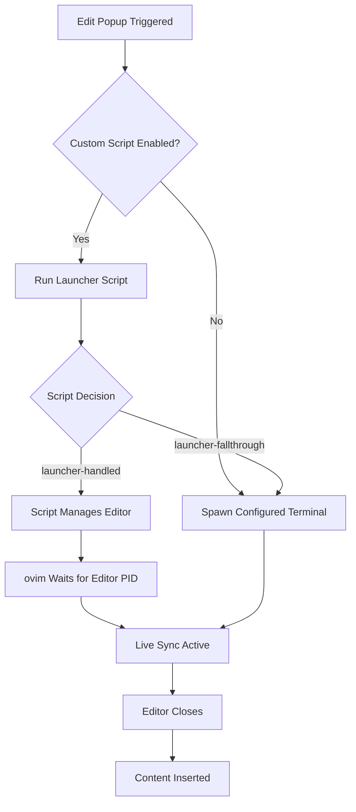
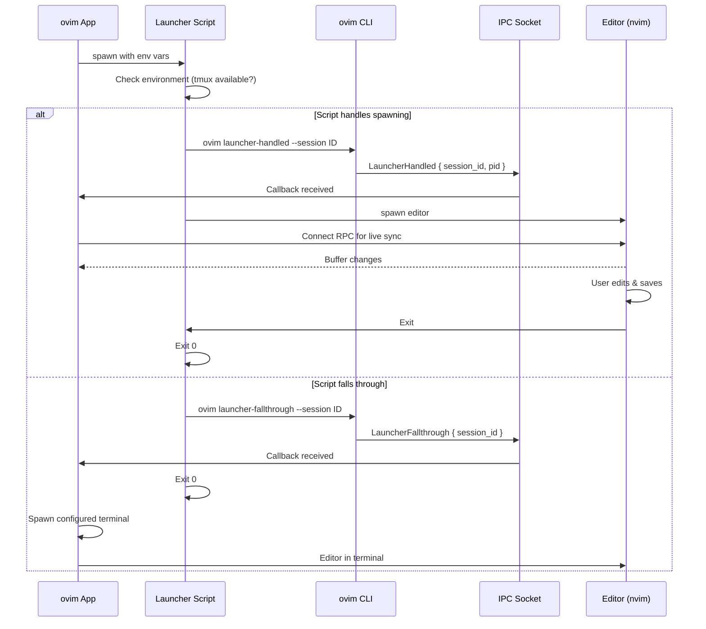

# Launcher Script System

The launcher script system allows you to customize how ovim spawns editors for the Edit Popup feature. You can use it to integrate with tmux, custom window managers, or any terminal workflow.

## Overview

When you enable "Use custom launcher script" in settings, ovim runs your script before spawning the terminal. The script can either:

1. **Handle spawning itself** - Run the editor in tmux, a custom terminal, etc.
2. **Fall through** - Let ovim spawn the editor using the configured terminal



## Quick Start

1. Enable "Use custom launcher script" in ovim settings
2. Edit `~/.config/ovim/terminal-launcher.sh`
3. Use CLI commands to signal your intent:
   - `ovim launcher-handled --session "$OVIM_SESSION_ID"` - You're handling it
   - `ovim launcher-fallthrough --session "$OVIM_SESSION_ID"` - Use normal flow

## Environment Variables

Your script receives these environment variables:

| Variable | Description |
|----------|-------------|
| `OVIM_FILE` | Path to the temp file to edit |
| `OVIM_EDITOR` | Configured editor executable (e.g., `nvim`) |
| `OVIM_SOCKET` | RPC socket path for live sync |
| `OVIM_SESSION_ID` | Unique session ID for IPC callbacks |
| `OVIM_TERMINAL` | Selected terminal type |
| `OVIM_WIDTH` | Popup width in pixels |
| `OVIM_HEIGHT` | Popup height in pixels |
| `OVIM_X` | Popup X position |
| `OVIM_Y` | Popup Y position |

## CLI Commands

Signal your script's intent using the ovim CLI:

```bash
# Signal that your script is handling the editor spawn
ovim launcher-handled --session "$OVIM_SESSION_ID" [--pid <editor_pid>]

# Signal to fall through to normal terminal flow
ovim launcher-fallthrough --session "$OVIM_SESSION_ID"
```

The `--pid` option is optional but recommended - it helps ovim track the editor process for proper cleanup.

## Examples

### Tmux Popup

Open the editor in a tmux popup window:

```bash
#!/bin/bash
export PATH="/opt/homebrew/bin:$HOME/.local/bin:$PATH"

# Check if tmux is available and has a session
if command -v tmux &>/dev/null && tmux list-sessions &>/dev/null 2>&1; then
    # Focus the terminal running tmux
    osascript -e 'tell application "Alacritty" to activate'

    # Signal we're handling it
    ovim launcher-handled --session "$OVIM_SESSION_ID"

    # Open editor in tmux popup (blocks until closed)
    tmux popup -E -w 80% -h 80% "$OVIM_EDITOR --listen $OVIM_SOCKET $OVIM_FILE"

    exit 0
fi

# No tmux - fall through to normal terminal
ovim launcher-fallthrough --session "$OVIM_SESSION_ID"
exit 0
```

### Tmux Split Pane

Open in a new tmux pane instead of popup:

```bash
#!/bin/bash
export PATH="/opt/homebrew/bin:$HOME/.local/bin:$PATH"

if command -v tmux &>/dev/null && tmux list-sessions &>/dev/null 2>&1; then
    osascript -e 'tell application "Alacritty" to activate'

    # Create a new pane and get its ID
    PANE_ID=$(tmux split-window -h -P -F '#{pane_id}' \
        "$OVIM_EDITOR --listen $OVIM_SOCKET $OVIM_FILE")

    # Get the PID of the process in that pane
    EDITOR_PID=$(tmux display-message -p -t "$PANE_ID" '#{pane_pid}')

    ovim launcher-handled --session "$OVIM_SESSION_ID" --pid "$EDITOR_PID"

    # Wait for pane to close
    while tmux list-panes -F '#{pane_id}' | grep -q "$PANE_ID"; do
        sleep 0.5
    done

    exit 0
fi

ovim launcher-fallthrough --session "$OVIM_SESSION_ID"
exit 0
```

### Send to Existing Neovim (via nvr)

Use neovim-remote to open in an existing neovim instance:

```bash
#!/bin/bash
export PATH="/opt/homebrew/bin:$HOME/.local/bin:$PATH"

# Check for existing nvim with a server
NVIM_SOCKET="/tmp/nvim-main.sock"

if [ -S "$NVIM_SOCKET" ]; then
    # Focus the terminal
    osascript -e 'tell application "Alacritty" to activate'

    # Open file in existing nvim
    nvr --servername "$NVIM_SOCKET" --remote "$OVIM_FILE"

    # Get nvim's PID
    NVIM_PID=$(lsof -t "$NVIM_SOCKET" 2>/dev/null | head -1)

    ovim launcher-handled --session "$OVIM_SESSION_ID" --pid "$NVIM_PID"

    # Wait for file to be closed in nvim
    while lsof "$OVIM_FILE" &>/dev/null; do
        sleep 0.5
    done

    exit 0
fi

ovim launcher-fallthrough --session "$OVIM_SESSION_ID"
exit 0
```

### Environment Setup Only

Just set up PATH without handling spawning:

```bash
#!/bin/bash
# Add homebrew and custom bins to PATH
export PATH="/opt/homebrew/bin:$HOME/.local/bin:$PATH"

# Always fall through - let ovim handle spawning
ovim launcher-fallthrough --session "$OVIM_SESSION_ID"
exit 0
```

### Conditional Terminal Selection

Choose different terminals based on context:

```bash
#!/bin/bash
export PATH="/opt/homebrew/bin:$HOME/.local/bin:$PATH"

# Check which apps are running
if pgrep -x "Alacritty" >/dev/null; then
    # Alacritty is running - use tmux popup
    if tmux list-sessions &>/dev/null 2>&1; then
        osascript -e 'tell application "Alacritty" to activate'
        ovim launcher-handled --session "$OVIM_SESSION_ID"
        tmux popup -E -w 80% -h 80% "$OVIM_EDITOR --listen $OVIM_SOCKET $OVIM_FILE"
        exit 0
    fi
fi

# Fall through to whatever terminal is configured
ovim launcher-fallthrough --session "$OVIM_SESSION_ID"
exit 0
```

## Architecture



## Tips

- **PATH Setup**: Always add `/opt/homebrew/bin` to PATH at the start of your script for macOS Homebrew binaries
- **Signal Early**: Call `ovim launcher-handled` before spawning long-running processes
- **Include PID**: Pass `--pid` when possible for better process tracking
- **Block Until Done**: Your script should wait for the editor to close before exiting
- **Error Handling**: If something fails, you can still call `launcher-fallthrough` as a fallback

## Troubleshooting

### Script not running
- Check that "Use custom launcher script" is enabled in settings
- Verify script is executable: `chmod +x ~/.config/ovim/terminal-launcher.sh`

### Editor doesn't open
- Check the script logs: `tail -f ~/Library/Logs/ovim/ovim.log`
- Verify PATH includes your editor: `which nvim`

### Live sync not working
- Ensure you're passing `--listen $OVIM_SOCKET` to the editor
- Check that the RPC socket is being created

### Fallthrough not working
- Ensure you're calling `ovim launcher-fallthrough` with the correct session ID
- Check that the ovim CLI is accessible (add to PATH or use full path)

## File Locations

| File | Purpose |
|------|---------|
| `~/.config/ovim/terminal-launcher.sh` | Your launcher script |
| `~/.config/ovim/samples/` | Sample scripts for reference |
| `~/.cache/ovim.sock` | IPC socket for CLI communication |
| `~/.cache/ovim/nvim_*.sock` | Per-session RPC sockets |
